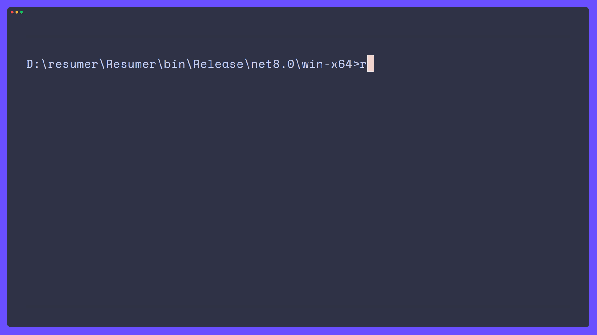

# resumer

save your skills, job experience and details to easily(?) build a resumé from them

[](https://github.com/csc530/resumer/actions/workflows/build.yml)

## why?

well, you know, formatting in Word is just.. eeghh😵‍💫😵‍💫🥴, ya
and sometimes I want to curate the jobs on the resume or just the look without all the work

### why not x

honestly, you probably should use *x* 🤷🏿‍♂️ (the other tool/app)
whatever is best and easiest for you😽
(but if you love being in your command line then this could be for you??)

## installation

### dependencies

- [typst](https://github.com/typst/typst?tab=readme-ov-file#installation) for pdf, svg, and png formats

download [latest release](https://github.com/csc530/resumer/releases/latest) from GitHub and add it to your PATH
:)

### from source

**requires [dotnet sdk](https://dotnet.microsoft.com/download)*

```bash
git clone https://github.com/csc530/resumer.git
cd resumer
dotnet publish -c Release -o ./path/to/publish/ideally/in/your/PATH
```

## add templates

open a pull request to contribute a template to the `templates folder`.
if the first line is a comment it will be used as the template's description and the file name as the template's name when importing with the `--all` flag

## todo ✅

- [idek](https://github.com/csc530/resumer/issues)
- [ ] add input template file: colours, layout, etc.
- [ ] vhs action

